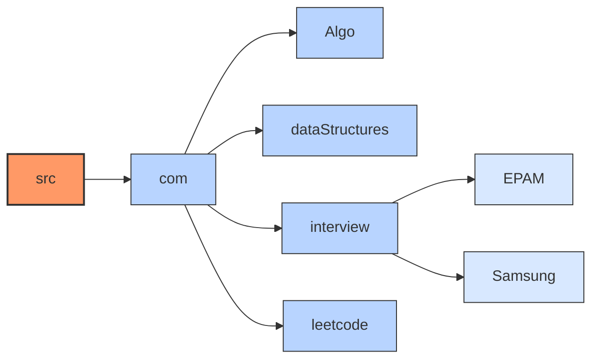

# DSA - Data Structure & Algorithms

This repository contains implementations of various data structures and algorithms in Java, as well as solutions to problems from coding platforms like LeetCode.

## Automated LeetCode Solutions Sync

This repository includes an automated system that syncs all your LeetCode solutions daily. It:

- Fetches all accepted solutions from your LeetCode account
- Organizes solutions by problem number in a structured format
<<<<<<< HEAD
- Enhances each solution with detailed problem information including:
  - Full problem description
  - Difficulty level
  - Topic tags
=======
- Enhances each solution with comprehensive problem information including:
  - Full problem description
  - Difficulty level and category
  - Topic tags
  - Problem statistics (acceptance rate, submissions)
  - Hints (when available)
  - Code templates
  - Example test cases
>>>>>>> 08162721dcdfaed440fb36c8117ac54adec1b141
  - Official solution from LeetCode (for non-premium problems)
  - Similar questions with links and difficulty levels
- Runs automatically every day at midnight UTC (5:30 AM IST)

### Setup Instructions

To enable the automated sync, follow these steps:

1. **Get your LeetCode authentication tokens**:
   - Log in to LeetCode in your browser
   - Open developer tools (F12 or right-click > Inspect)
   - Go to the Application tab (or Storage tab in Firefox)
   - Look under Cookies > leetcode.com
   - Find and copy the values for:
     - `csrftoken`
     - `LEETCODE_SESSION`

2. **Add authentication tokens as GitHub secrets**:
   - Go to your repository Settings → Secrets and variables → Actions
   - Add two new repository secrets:
     - `LEETCODE_CSRF_TOKEN`: Your LeetCode CSRF token
     - `LEETCODE_SESSION`: Your LeetCode session cookie

3. **Enable workflow permissions**:
   - Go to Settings → Actions → General
   - Under "Workflow permissions", select "Read and write permissions"

You can manually trigger the sync by going to the Actions tab and running the "Sync LeetCode" workflow.

## Folder Structure



The LeetCode solutions are organized directly under the `src/com/leetcode` directory:

```
src/com/leetcode/
├── 1-two-sum/
│   ├── Solution.java
│   └── README.md
├── 2-add-two-numbers/
│   ├── Solution.java
│   └── README.md
└── ...
```

Each problem directory contains:
- The solution code in Solution.java
<<<<<<< HEAD
- A detailed README.md with problem description, difficulty, tags, official solution (where available), and similar questions
=======
- A comprehensive README.md with:
  - Problem description
  - Difficulty and category
  - Topic tags
  - Problem statistics
  - Hints and example test cases
  - Code templates
  - Official solution (where available)
  - Similar questions
>>>>>>> 08162721dcdfaed440fb36c8117ac54adec1b141

## Resources

- Samsung Interview Guide: [https://app.simplenote.com/p/mJ65BH](https://app.simplenote.com/p/mJ65BH)
- EPAM Interview Guide: [EPAM Interview Guide](https://github.com/saurabh111121/DSA/blob/main/src/com/interview/EPAM/EPAM_Interview_Guide.md) (Updated till Feb 2025)
- [LeetCode Sync Documentation](scripts/README.md): Details on how the LeetCode sync automation works
