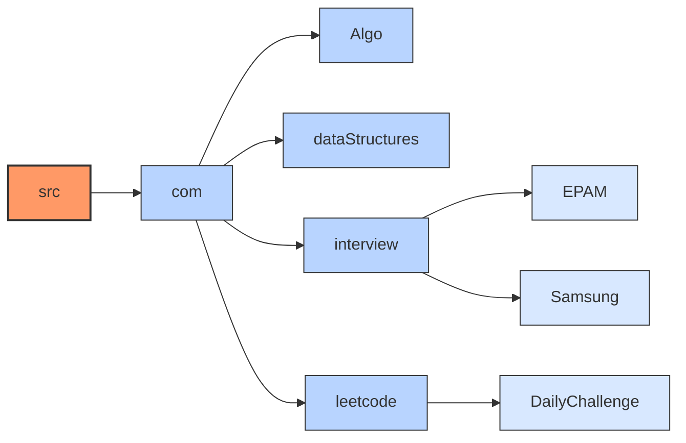

# DSA - Data Structure & Algorithms

This repository contains implementations of various data structures and algorithms in Java, as well as solutions to problems from coding platforms like LeetCode.

## Folder Structure Dependency Graph

## Resources

- Samsung Interview Guide: [https://app.simplenote.com/p/mJ65BH](https://app.simplenote.com/p/mJ65BH)
- EPAM Interview Guide: [EPAM Interview Guide](https://github.com/saurabh111121/DSA/blob/main/src/com/EPAM/EPAM_Interview_Guide.md) (Updated till Feb 2025)
