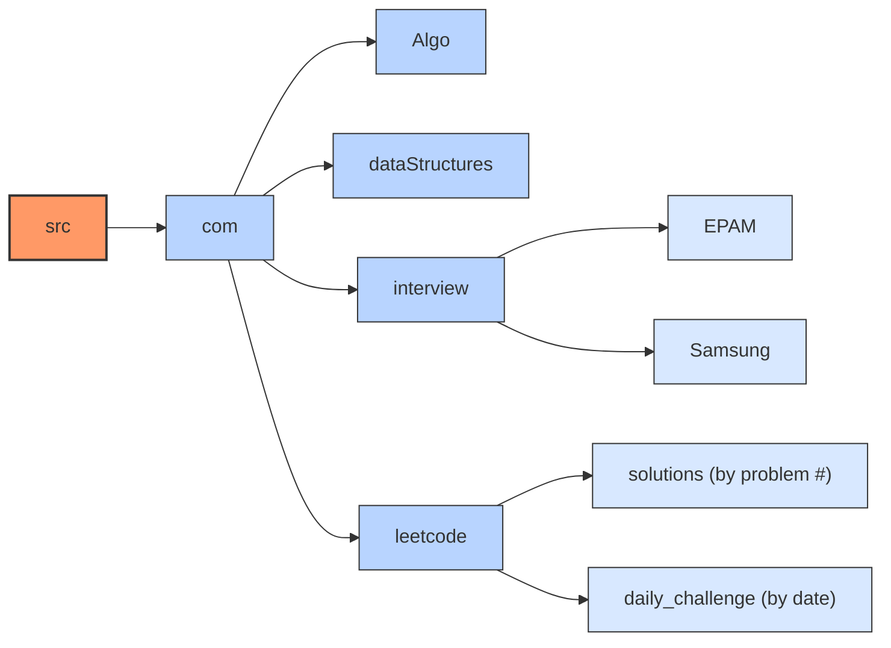

# DSA - Data Structure & Algorithms

This repository contains implementations of various data structures and algorithms in Java, as well as solutions to problems from coding platforms like LeetCode.

## Automated LeetCode Solutions Sync

This repository includes an automated system that syncs all your LeetCode solutions daily. It:

- Fetches all accepted solutions from your LeetCode account (111121saurabh)
- Creates well-structured solution files with proper formatting
- Generates comprehensive README files with problem descriptions, difficulty, tags, etc.
- Organizes solutions by problem number and maintains a separate section for daily challenges
- Runs automatically every day at midnight UTC (5:30 AM IST)

### Setup Instructions

To enable the automated sync, add these secrets to your GitHub repository:

1. Go to your repository Settings → Secrets and variables → Actions
2. Add two new repository secrets:
   - `LEETCODE_USERNAME`: Your LeetCode username
   - `LEETCODE_PASSWORD`: Your LeetCode password

You can also manually trigger the sync by going to the Actions tab and running the "LeetCode Sync" workflow.

## Folder Structure

## Resources

- Samsung Interview Guide: [https://app.simplenote.com/p/mJ65BH](https://app.simplenote.com/p/mJ65BH)
- EPAM Interview Guide: [EPAM Interview Guide](https://github.com/saurabh111121/DSA/blob/main/src/com/interview/EPAM/EPAM_Interview_Guide.md) (Updated till Feb 2025)
- [LeetCode Sync Documentation](scripts/README.md): Details on how the LeetCode sync automation works
