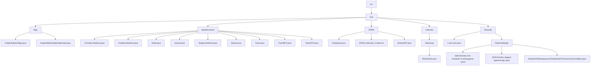

# DSA - Data Structure & Algorithms

This repository contains implementations of various data structures and algorithms in Java, as well as solutions to problems from coding platforms like LeetCode.

## Repository Structure

The repository is organized into the following main categories:

- **Data Structures**: Implementation of common data structures (LinkedList, Queue, Stack, Trees)
- **Algorithms**: Implementation of algorithms like Dijkstra's algorithm
- **LeetCode**: Solutions to LeetCode problems, including daily challenges
- **Interview Preparation**: Company-specific interview preparation materials
  - Samsung
  - EPAM

## File Structure Flowchart

## Key Components

### Data Structures
- **LinkedList**: Implementations of Singly, Doubly, and Circular LinkedLists
- **Queue**: Queue implementation
- **Stack**: Stack implementation
- **Trees**: Basic tree implementation along with BFS and DFS traversal algorithms

### Algorithms
- **Dijkstra's Algorithm**: Implementation of graph shortest path algorithm and its optimized version

### LeetCode Solutions
- Solutions to various LeetCode problems
- Daily challenge solutions

### Interview Preparation
- **Samsung**: Problem solutions specific to Samsung interviews
- **EPAM**: Interview guide and solutions specific to EPAM interviews

## Resources

- Samsung Interview Guide: [https://app.simplenote.com/p/mJ65BH](https://app.simplenote.com/p/mJ65BH)
- EPAM Interview Guide: [EPAM Interview Guide](https://github.com/saurabh111121/DSA/blob/main/src/com/EPAM/EPAM_Interview_Guide.md) (Updated till Feb 2025)
